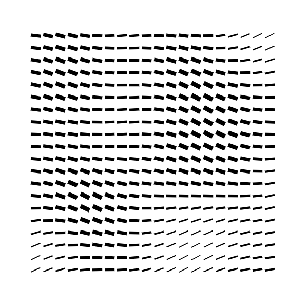

# Creative coding in JS & Canvas

These different projects/examples does not need external dependencies, everything needed are in the folder of the examples. It run in browser, just click in the `demo` link of the examples and you can play with several variables impacting the "beauty" of the exercise.

|Website|Repositories|
|---|---|
|[rlasjunies.github.io/Creative-coding](https://rlasjunies.github.io/Creative-coding/)|[github/rlasjunies/creative-coding](https://github.com/rlasjunies/Creative-coding/)|

|Thumbnail|Title             |Demo    |Code repository   |
|:-----------:|----------------------|:------------:|:-------------:|
||**25 squares** Simple and basic setup.|[demo](./25squares/25squares.html)|[Github repository](https://github.com/rlasjunies/Creative-coding/tree/master/25squares)|
||**Matrix rain** Full setup including setting pane.|[demo](./matrixrain/index.html)|[Github repository](https://github.com/rlasjunies/creative-coding/tree/master/matrixrain)|
||**Vibrating circle** Enhanced panel with refresh or animation. Drawing is placed in a specific file|[demo](./vibrating-circle/index.html)|[Github repository](https://github.com/rlasjunies/creative-coding/tree/master/vibrating-circle)|
||**Flying connected dots** Creation of agent and scene|[demo](./flying-connected-dots/index.html)|[Github repository](https://github.com/rlasjunies/creative-coding/tree/master/flying-connected-dots)|
||**Wavy rectangle** Rectangles moving based on random simplex 3D noise.|[demo](./wavy-rectangles/index.html)|[Github repository](https://github.com/rlasjunies/creative-coding/tree/master/wavy-rectangles)|
||**Letter redesigned** Draw a letter with different glyphs|[demo](./letter-redesigned/index.html)|[Github repository](https://github.com/rlasjunies/creative-coding/tree/master/letter-redesigned)|
||**Flow field effect** Draw small lines following trigonometric pattern.Play with a lot of variable and automatic variations|[demo](./flow-field-effect/index.html)|[Github repository](https://github.com/rlasjunies/creative-coding/tree/master/flow-field-effect)|

## How to dev via vscode?

* install extension [livepreview'](https://marketplace.visualstudio.com/items?itemName=ms-vscode.live-server)
* right click on the the `index.html` you would like to implement

## To do

* save button to save image including settings

## link reference
* Repository for the [Creative Coding training](https://www.domestika.org/fr/courses/2729-codage-creatif-creez-des-elements-visuels-avec-javascript/units/9668-fondamentaux)

* https://github.com/mattdesl/canvas-sketch
  * [documentation](https://github.com/mattdesl/canvas-sketch/blob/master/docs/README.md)

* https://www.w3schools.com/tags/ref_canvas.asp

* https://www.youtube.com/watch?v=f5ZswIE_SgY

* 
